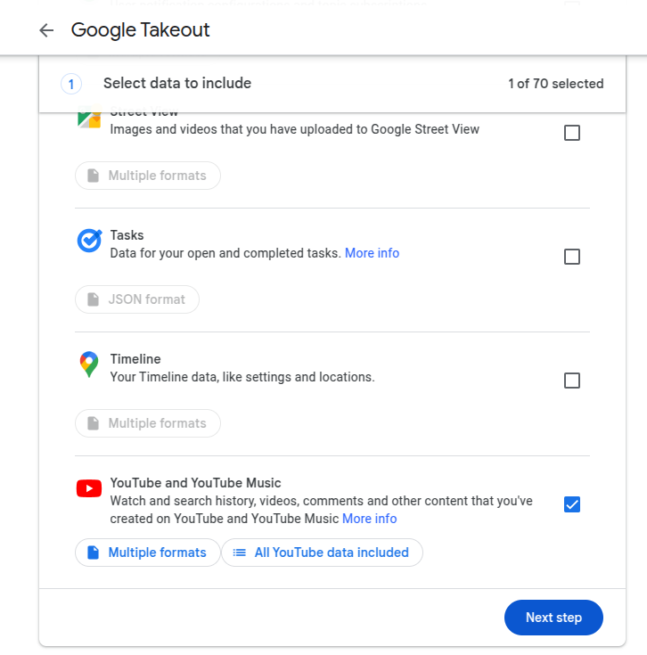

# YouTube Watch History Extractor: Convert HTML to CSV & JSON

  

## 📌 Overview
YouTube Watch History Extractor is a Python script that **parses and extracts structured data** from a YouTube `watch-history.html` file. It converts your YouTube watch history into **CSV and JSON formats**, making it easier to analyze trends, track favorite creators, and build datasets for further research.

## 🚀 Features
- ✅ Extracts **video titles, URLs, channel names, timestamps** from YouTube history.
- ✅ Outputs structured **CSV and JSON files** for easy data manipulation.
- ✅ Efficient **HTML parsing** with BeautifulSoup.
- ✅ Handles **large history files** smoothly (40MB HTML file ≈ 40 minutes runtime of python script).
- ✅ Useful for **personal analytics, recommendations, and archiving.**

## 📂 Example Output

**CSV (watched_history.csv)**
| video_title      | video_url        | channel_name | channel_url   | date       | time     |
|-----------------|-----------------|-------------|--------------|-----------|---------|
| Sample Video 1  | abc123xyz        | Tech Guru   | channel456   | 2024-01-20 | 15:34:12 |

**JSON (watched_history.json)**
```json
[
    {
        "video_title": "Sample Video 1",
        "video_url": "abc123xyz",
        "channel_name": "Tech Guru",
        "channel_url": "channel456",
        "date": "2024-01-20",
        "time": "15:34:12"
    }
]
```


---

## **How to Download Your YouTube Watch History**  
Follow these steps to download your **watch-history.html** file from Google:  

### **Step 1: Go to Google Takeout**  
1. Visit [Google Takeout](https://takeout.google.com/).  
2. Sign in with your Google account if prompted.  

### **Step 2: Select Only YouTube History**  
1. Click **"Deselect all"** to remove all other Google data.
2. Scroll down and check **"YouTube and YouTube Music"**. 
  
3. Click **"All YouTube data included"**, uncheck everything except **"History"**, then click OK.
    

### **Step 3: Configure the Export**  
1. Scroll down and click **"Next step"**.  
2. Under "Delivery method," choose **"Download link via email"** (or another preferred option).  
3. Select **"Export once"** and **".ZIP"** format (recommended).  
    
4. Click **"Create Export"**.  

### **Step 4: Download and Extract Your Data**  
1. Wait for Google to process your request (it may take minutes to hours).  
2. Once done, download the ZIP file from the email link.  
3. Extract the ZIP file to access the folder named **"Takeout"**.  

### **Step 5: Locate Your Watch History File**  
1. Inside the extracted folder, navigate to:  
   **`Takeout > YouTube and YouTube Music > history`**  
2. Look for a file named **`watch-history.html`**.  
3. Copy this file to the same directory where you'll run this script.  

> ✅ Now you're ready to use the YouTube Watch History Extractor! 🚀  

---

## 🛠️ Installation

1. **Clone the repository**
   ```sh
   git clone https://github.com/atishramkhe/YouTube-Watch-History-Extractor-Convert-HTML-to-CSV-JSON
   cd YouTube-Watch-History-Extractor-Convert-HTML-to-CSV-JSON
   ```

2. **Install dependencies**
   Ensure you have Python 3.8+ installed, then run:
   ```sh
   pip install -r requirements.txt
   ```

3. **Place your YouTube history file**
   Download your `watch-history.html` from [Google Takeout](https://takeout.google.com/) and move it to the script directory.

### ▶️ Usage  

Make sure that the `watch-history.html` file is in the **same directory** as the Python script. Then, run the script to extract and save history data:  

```bash
python extract_watch_history.py
```  

This will generate two output files in the same directory:  
- `watched_history.csv`  
- `watched_history.json`  

---

## 🎯 Potential Use Cases
- **Data Analysis**: Track watch patterns and preferences.
- **Machine Learning**: Train recommendation models based on user history.
- **Personal Archiving**: Keep records of watched content.
- **Integration**: Use extracted data for custom dashboards or automation.

## 🤝 Contributing
Contributions are welcome! Feel free to:
- Report issues 🐞
- Suggest improvements 🚀
- Submit pull requests 📌

## 📜 License
This project is licensed under the **MIT License**.

## 📧 Contact
Created by **Atish K. Ramkhelawon**
- GitHub: [atishramkhe](https://github.com/atishramkhe)
- LinkedIn: [Atish K. Ramkhelawon](https://www.linkedin.com/in/atish-ramkhelawon-10a806b8/)
